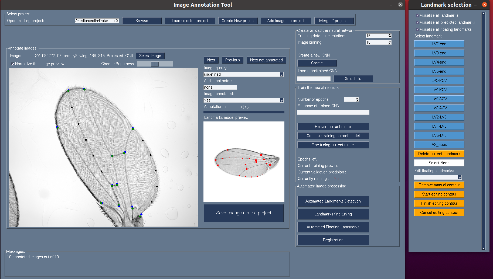

Image registration GUI
==============================

<!-- ABOUT THE PROJECT -->
## About The Project

This open-source project provides a user-friendly graphical interface for image annotation, landmark placement, and image registration.
The GUI also provides an interface to train and use a convolutional neural network model to predict landmark positions, and to automatically place additional uniformly spaced landmarks along edges or ridges in the image using an active contour fitting algorithm.

This project is still a work-in-progress and some features are not fully developed yet.

 

<!-- ROADMAP -->
## Current Roadmap

Here's what we're currently working on and planning for the future:

- [x] Integrate Active Contour Fitting:
    - [x] Implement automated fitting of active contour along ridges and edges.
    - [x] Integrate floating landmarks derived from active contour fitting into the image registration process.
    - [x] Expand the GUI to allow manual review and editing of the automated active contour.
    - [ ] Expand the GUI to define an active contour model for any new dataset.
- [ ] Add a Comprehensive Test Dataset.
- [ ] Add Complete Documentation.
- [ ] Implement Logging for improved debugging and tracking.
- [ ] Ensure Cross-Platform Compatibility.
- [ ] Long-term Goal: Refactor the code to clearly separate backend and frontend for maintainability.

<!-- LICENSE -->
## License

Distributed under the MIT License. See `LICENSE.txt` for more information.

(<a href="#readme-top">back to top</a>)

